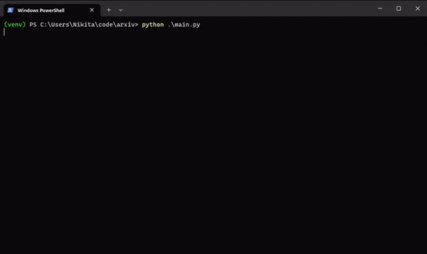

# arxivchat-metaphor

ArXivChat is a user-friendly CLI tool that simplifies the process of finding and interacting with ArXiv papers using Metaphor's AI-powered search. It employs ChatGPT as an assistant to help you effortlessly discover and engage with academic content.

## Overview

ArXivChat was built using Metaphor's AI-powered search paired with a ChatGPT assistant to answer any questions a user can have about the paper. Given a user query, we first search with Metaphor's API (search domain restricted to https://arxiv.org) and retrieve 5 relevant papers.

ArXiv IDs from Metaphor's search are saved and an abstract for each paper is retrieved through the ArXiv API. ChatGPT summarizes each abstract and presents the search results to the user. ChatGPT also recommends a paper it thinks most relevant to the search query.

User then chooses a paper out of the provided results for chatting. The entire content of the paper (excluding references) is pulled and stored in a vector store instance (embeddings generated by OpenAI's Ada v2 model). Chatting with paper is then abstracted through LangChain's `ConversationalRetrievalChain`.

## Challenges / Feedback on Metaphor API

- Metaphor search returns duplicate results oftentimes.
- Altering the search query without changing the semantic meaning can produce very different search results.
- `get_content()` is difficult to present in a readable format, and by extension, difficult to parse and extra relevant information.

### Why I'm interested in Metaphor 😁

I think Metaphor can become the primary tool used in LLM applications or in retrieval-augmented generation. LLMs suffer from hallucinations and outdated training data, and so having an internet-connected search tool optimized for these models can significantly mitigate these challenges. I would love to be part of the team and contribute towards this goal!
